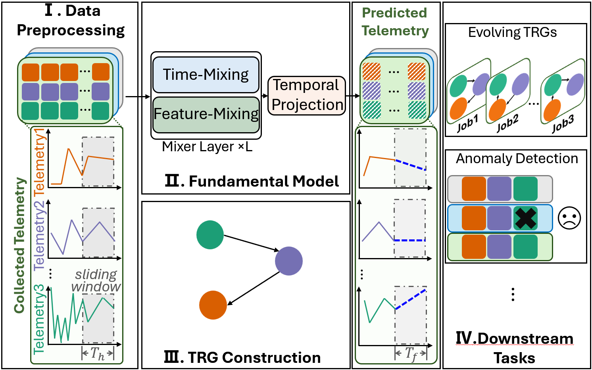
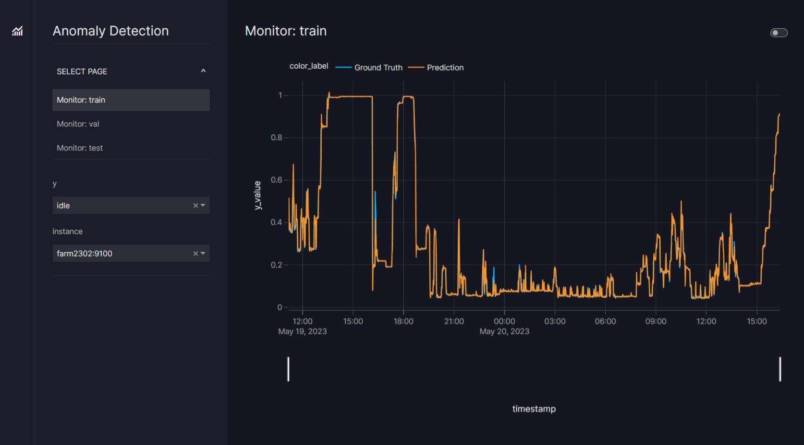
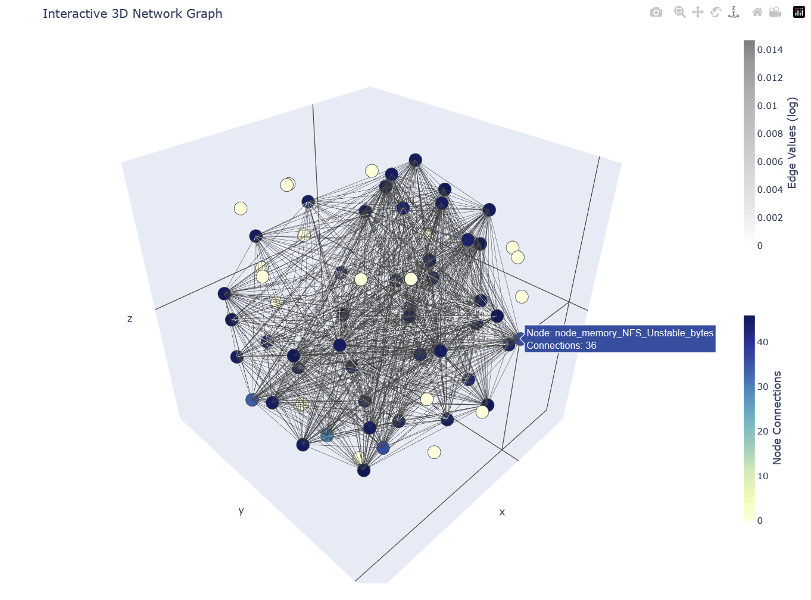
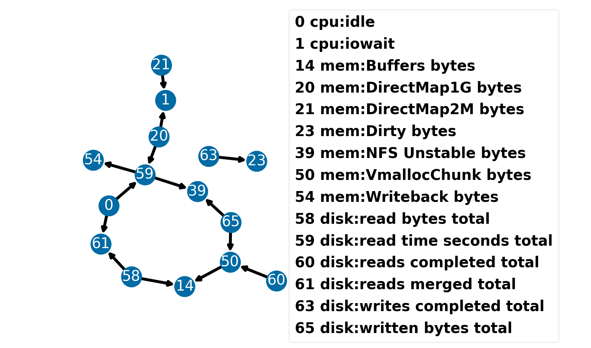

# Mantis

<div align="center">
  
</div>

Mantis is a framework for predicting and interpreting High-Performance Computing (HPC) telemetry data. It performs predictive modeling on unlabeled data to capture both the temporal relationships within individual telemetry streams and the complex interactions between different streams.

# Install

Install the Mantis environment using conda. We provide a script for quick installation:

```bash
./build_env/autosetup.sh
```

If you run into any issues with the script, you can set up the environment manually according to the steps in `build_env/README.md`.

# Dataset

All data is publicly available.

| Dataset Name | # of telemetry | # of hosts | size (GB) | data source                                       | data collect frequency                | Download |
| ------------ | -------------- | ---------  | --------- | ------------------------------------------------- | ------------------------------------- | -------- |
| JLab         | 66             | 332        | 180       | Prometheus, Slurm                                 | 1 min per job                         | [1]      |
| OLCF         | 28             | 4626       | 492       | GPULog, OpenBMC, Job scheduler allocation history | at occurrence; 1 sec / 10 sec per job | [2,3]    |


[1] [Dataset for Investigating Anomalies in Compute Clusters](https://zenodo.org/records/10058230  )

[2] [Long Term Per-Component Power and Thermal Measurements of the OLCF Summit System](https://doi.ccs.ornl.gov/dataset/086578e9-8a9f-56b1-a657-0ed8b7393deb)  

[3] [OLCF Summit Supercomputer GPU Snapshots During Double-Bit Errors and Normal Operations](https://doi.ccs.ornl.gov/dataset/56c244d2-d273-5222-8f4b-f2324282fab8)

 Perfect synchronization is impossible during extremely large-scale data collection from hundreds of nodes with varied hardware telemetry. Therefore, the raw data suffers from unstable sampling rates and missing values. We cleaned the data using `PySpark` and `Dask` and will release the final dataset for training, validation, and testing.

# Example

## Quick Start
Start Mantis with the script:
```
conda activate fmhpc
./scripts/run.sh
```
The output results will be stored in the `result` folder.

## Visualize result

### Telemetry Analysis

Mantis enables accurate prediction of HPC telemetry streams. Using `vizro` and `plotly`, Mantis provides interactive charts for detailed analysis, as shown by the successful predictions in the example below. The chart allows you toquickly inspect each telemetry on any compute nodes.

```
python visualization/monitor_page.py
```
<div align="center">
  
</div>
<p align="center">Figure 1: Telemetry Analysis</p>

### Telemetry Relation Graph (TRG)
Mantis enables interpretation of telemetry relationships with TRGs. With the help of `plotly`, Mantis provides interactive 3d network charts to visualize TRGs.
```
python visualization/interactice_network.py
```
<div align="center">
  
</div>
<p align="center">Figure 2: Telemetry Relation Graph</p>

With the help of `networkx`, Mantis could further reveal the core structures of the complex TRGs.
```
python visualization/core_network.py
```
<div align="center">
  
</div>
<p align="center">Figure 3: Telemetry Relation Graph (after pruning)</p>


# Model Architecture Justification(Ablation study)

The Mantis Model (SysMixer) employs a two-component architecture designed for High-Performance Computing (HPC) telemetry forecasting. These components are:

1. **Time-Mixing Module:** An MLP module focused on capturing temporal dependencies and patterns within individual telemetry time series.
2. **Feature-Mixing Module:** An MLP module designed to model the dependencies _across_ different telemetry variables originating from the same compute node.

While compute nodes in HPC clusters exhibit interdependence due to shared resources (e.g., network, parallel file systems), potentially motivating a third component for modeling cross-node relationships (a "node-mixing" module), our analysis indicates that the two-component SysMixer architecture achieves superior performance.

To justify this design choice, we compared the standard SysMixer against two variants:

- **SysMixer-TM (Time-Mixing Only):** A baseline model containing only the time-mixing module, thus capturing only intra-telemetry temporal dynamics.
- **SysMixer-NM (Node-Mixing Included):** A more complex model incorporating time-mixing, feature-mixing, and an additional node-mixing module to explicitly model cross-node interactions.

Performance was evaluated using the Root Mean Squared Error (RMSE) on the JLab and OLCF datasets.

**Performance Comparison:**

- **Overall Performance:** As shown in the following table, the  SysMixer achieves the lowest average RMSE across all telemetries on both datasets.
    
<table>
    <thead>
        <tr>
            <th>Dataset</th> 
            <th>JLab</th>
            <th>OLCF</th>
        </tr>
    </thead>
    <tbody>
        <tr>
            <td>SysMixer-TM</td> <td>4.6e-2</td> <td>4.6e-2</td>
           </tr>
           <tr>
            <td>SysMixer-NM</td> <td>2.0e-3</td> <td>4.4e-1</td>
           </tr>
           <tr>
            <td>SysMixer</td> <td>1.9e-3</td> <td>2.3e-2</td>
           </tr>
    </tbody>
</table>

- **Detailed Performance:** As shown in the following tables, the SysMixer consistently outperforms others for the 5 highest- and 5 lowest-RMSE telemetry metrics per dataset.

<table>
  <thead>
    <tr>
      <th rowspan="2">Dataset</th>
      <th colspan="10">JLab</th>
    </tr>
    <tr>
      <th colspan="5">Telemetris w/ Highest RMSE</th>
      <th colspan="5">Telemetries w/ Lowest RMSE</th>
    </tr>
  </thead>
  <tbody>
    <tr>
      <th>Features</th>
      <th>cpu: nice</th>
      <th>disk: io now</th>
      <th>cpu: idle</th>
      <th>cpu: user</th>
      <th>cpu: softirq</th>
      <th>mem: Mlocked bytes</th>
      <th>mem: HugePages Rsvd</th>
      <th>mem: Unevictable bytes</th>
      <th>mem: CommitLimit bytes</th>
      <th>mem: MemTotal bytes</th>
    </tr>
    <tr>
      <td>SysMixer-TM</td>
      <td>4.40E-02</td>
      <td>3.10E-02</td>
      <td>1.60E-01</td>
      <td>4.70E-02</td>
      <td>2.60E-02</td>
      <td>2.70E-02</td>
      <td>2.70E-02</td>
      <td>2.70E-02</td>
      <td>6.20E-02</td>
      <td>6.20E-02</td>
    </tr>
    <tr>
      <td>SysMixer-NM</td>
      <td>3.30E-02</td>
      <td>1.60E-02</td>
      <td>1.30E-02</td>
      <td>1.30E-02</td>
      <td>5.70E-03</td>
      <td>3.10E-05</td>
      <td>2.40E-05</td>
      <td>2.40E-05</td>
      <td>2.00E-05</td>
      <td>2.20E-05</td>
    </tr>
    <tr>
      <td>SysMixer</td>
      <td>3.20E-02</td>
      <td>1.50E-02</td>
      <td>1.20E-02</td>
      <td>1.10E-02</td>
      <td>5.70E-03</td>
      <td>9.70E-06</td>
      <td>9.50E-06</td>
      <td>9.40E-06</td>
      <td>8.70E-06</td>
      <td>7.50E-06</td>
    </tr>
  </tbody>
</table>

<table>
  <thead>
    <tr>
      <th rowspan="2">Dataset</th>
      <th colspan="10">OLCF</th>
    </tr>
    <tr>
      <th colspan="5">Telemetris w/ Highest RMSE</th>
      <th colspan="5">Telemetries w/ Lowest RMSE</th>
    </tr>
  </thead>
  <tbody>
    <tr>
      <th>features</th>
      <th>p1_gpu2_power</th>
      <th>p1_gpu1_power</th>
      <th>p1_gpu0_power</th>
      <th>p0_gpu1_power</th>
      <th>p0_gpu0_power</th>
      <th>p1_temp_mean</th>
      <th>p0_temp_mean</th>
      <th>ps0_input_power</th>
      <th>p1_temp_min</th>
      <th>p0_temp_min</th>
    </tr>
    <tr>
      <td>SysMixer-TM</td>
      <td>8.10E-02</td>
      <td>8.70E-02</td>
      <td>8.30E-02</td>
      <td>8.70E-02</td>
      <td>8.30E-02</td>
      <td>2.20E-02</td>
      <td>1.80E-02</td>
      <td>6.20E-02</td>
      <td>5.40E-02</td>
      <td>5.40E-02</td>
    </tr>
    <tr>
      <td>SysMixer-NM</td>
      <td>6.30E-01</td>
      <td>5.50E-01</td>
      <td>4.90E-01</td>
      <td>5.50E-01</td>
      <td>5.10E-01</td>
      <td>2.10E-01</td>
      <td>2.80E-01</td>
      <td>2.50E-01</td>
      <td>1.10E-03</td>
      <td>3.10E-04</td>
    </tr>
    <tr>
      <td>SysMixer</td>
      <td>4.50E-02</td>
      <td>4.50E-02</td>
      <td>4.50E-02</td>
      <td>4.50E-02</td>
      <td>4.40E-02</td>
      <td>1.00E-02</td>
      <td>1.00E-02</td>
      <td>5.70E-03</td>
      <td>4.00E-05</td>
      <td>2.20E-05</td>
    </tr>
  </tbody>
</table>


# TRG Hyperparameter ϵ Analysis

The TRG construction algorithm utilizes a hyperparameter, ϵ, to regulate the magnitude of perturbation during its process. For the Mantis implementation, a value of ϵ=0.01 was selected.

To evaluate the robustness of the resulting graph structure to this choice, we performed a sensitivity analysis. TRGs were generated using various ϵ values ranging from 0.001 to 0.1. We then calculated the similarity between each resulting graph and the baseline graph generated using the chosen ϵ=0.01. The results for the JLab and OLCF datasets are presented in the following table.

| $\epsilon$ | 0.001 | 0.002 | 0.003 | 0.004 | 0.005 | 0.006 | 0.007 | 0.008 | 0.009 | 0.01 | 0.02 | 0.03 | 0.04 | 0.05 | 0.06 | 0.07 | 0.08 | 0.09 | 0.1  |
| :------- | ----: | ----: | ----: | ----: | ----: | ----: | ----: | ----: | ----: | ---: | ---: | ---: | ---: | ---: | ---: | ---: | ---: | ---: | ---: |
| JLab    | 0.88  | 0.86  | 0.86  | 0.82  | 0.93  | 0.87  | 0.89  | 0.87  | 0.83  | 1    | 0.85 | 0.85 | 0.82 | 0.83 | 0.83 | 0.84 | 0.86 | 0.84 | 0.9  |
| OLFC    | 0.9   | 0.9   | 0.74  | 0.87  | 0.91  | 0.76  | 0.91  | 0.84  | 0.92  | 1    | 0.88 | 0.87 | 0.66 | 0.91 | 0.91 | 0.89 | 0.88 | 0.9  | 0.87 |

- The TRG construction is not overly sensitive to the precise value of ϵ.
